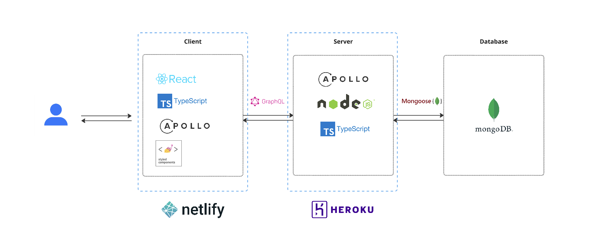
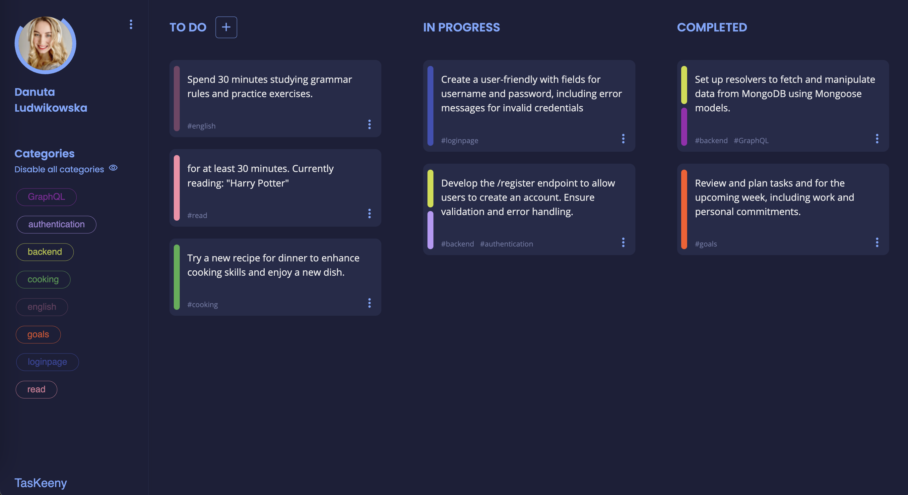

# TasKeeny 🎯

This project is a task management application that features a unique category segregation mechanism based on hashtag recognition. It is designed to help users organize and manage their tasks efficiently by categorizing them with hashtags.

## Project Overview

### User Onboarding:

- **Account Creation**: Users need to sign up via the /register panel to create an account.
- **Login**: After registration, users can log in to the application using the /login page.

### Key Features:

- **Task Creation:** Users can create tasks with a detailed description and a status indicator (TO DO, IN PROGRESS, COMPLETED
- **Hashtag-Based Categorization:** Each task must include at least one hashtag in its description to assign it to a specific category. Multiple hashtags (categories) can be used for a single task.
- **Filtering:** Users can filter the board view by enabling or disabling specific hashtags to focus on certain categories of tasks.

### Tags Management:

- Hashtags cannot be deleted outright.
- A hashtag/category is automatically removed if there are no tasks associated with it on the board.
- Hashtags can be disabled when not in use.

### Task Deletion:

- Users can delete tasks as needed.

### Theme Customization:

- The application allows users to switch between light and dark themes for a personalized user experience.

## Technical Stack and Architecture

### Technologies used:

- **Frontend:** React, TypeScript, Styled Components
- **Backend:** Node.js, Express.js, GraphQL
- **Database:** MongoDB (Atlas)
- **Deployment:** Netlify (Frontend), Heroku (Backend)

### Architecure decisions:

- **Adopted a React-based frontend with TypeScript** for type safety and scalability. TypeScript helps catch errors early in the development process and makes the codebase easier to maintain.
- **Used styled-components for CSS-in-JS** to maintain modular and scoped styling, allowing for dynamic styling based on props and state.
- **Implemented React Router** for handling client-side routing, enabling.
- **Leveraged the Context API for state management** across components, providing a way to share state globally without prop drilling.
- **Used GraphQL for Data Fetching and Mutations:** to efficiently query and mutate data, allowing for precise data fetching and reducing over-fetching of data. This provides flexibility for the frontend to request exactly what it needs.
- **Backend with Node.js and Express:** Built the server using Node.js and Express for a robust and scalable backend.
- **MongoDB as the Database:** Selected MongoDB for its flexible schema design and scalability, which is well-suited for handling dynamic and hierarchical data structures.
- **Mongoose for MongoDB Integration:** Utilized Mongoose as the ODM (Object Data Modeling) library to provide schema validation and a straightforward way to interact with MongoDB.
- **Code Generation with GraphQL Code Generator:** Integrated GraphQL Code Generator to automate the generation of TypeScript types and GraphQL operations, ensuring type safety and reducing manual coding effort.
- **User Authentication:** Implemented user authentication using JSON Web Tokens (JWT) for secure and stateless authentication, ensuring that user sessions are protected and easily manageable.
- **Formatting:** Adopted Prettier for consistent code style and quality, ensuring the codebase remains clean and maintainable.
- **Deployment with Netlify and Heroku:** Deployed the frontend on Netlify for its simplicity, and the backend on Heroku for its ease of setup.

### Simple Architecture Diagram:



# Getting Started

- **node version:** 14.17.6
- **npm version:** 6.14.15

## Client

Go to client:

- `cd client`

Run application in dev mode:

- `npm install`
- `npm run start:dev`

Client runs on: http://localhost:3000/

## Server

Go to server:

- `cd server`

**Setup environment variables:** You need to copy **dev.example.ts** file and rename the copy to **dev.ts**. Create database in mongoDB and once created replace the placeholders values with your MONGODB and SECRET_KEY.

<a href="https://www.mongodb.com/lp/cloud/atlas/try4?utm_source=google&utm_campaign=search_gs_pl_evergreen_atlas_general_prosp-brand_gic-null_emea-pl_ps-all_desktop_eng_lead&utm_term=mongo%20db%20tutorial&utm_medium=cpc_paid_search&utm_ad=p&utm_ad_campaign_id=10947982926&adgroup=108885991393&cq_cmp=10947982926&gad_source=1&gclid=CjwKCAjw4f6zBhBVEiwATEHFVvTUfSupVh47ZyYwe8JOEj728Fzn1ysU7Ca3A7n0SLnTrQdScJPswRoC3RIQAvD_BwE">MongoDB</a>

Run application in dev mode:

- `npm install`
- `npm run start:dev`

Server runs on: http://localhost:8001/graphql

To start play with graphiql you need to add **Autorization** header into **HTTP HEADERS**

```
{
  "Authorization": "jwtToken_XXXXXeyJhbGciOiJIUzI1NiIXXXXXXXXXxxxxxxxxxx"
}
```

It can be grabbed from the **local storage** after login to the application.

## Development

To generate code from your GraphQL schema you need to use **codegen**.
You can do that with command listed below. Run it from **root** directory of the project.

- `npm run codegen`

Before commit to the repository code should be formatted

- `npm run format`

## Deploy

**Server**

- Server is hosted on **heroku**.

From the **root directory** of project run command:\
`git subtree push --prefix server heroku master`

tip: if the changes require **force** push then run:\
`` git push heroku `git subtree split --prefix server master`:master --force ``

Changes should be visible on:\
https://taskeeny-api-98e51814f9e4.herokuapp.com/graphql

**Client**

- Client is hosted on **netlify**.

From the **/client directory** run command:

1.  `npm run build`
2.  `netlify deploy `
3.  type **public** in the command line
4.  Netlify will return the link to stg. Check it and if your changes work on it then run the command returned from netlify to push your changes on production.

Changes should be visilbe on: https://taskeeny.netlify.app/

# UI & Design

### Register


### Login


### Dashboard light theme


### Dashboard with filtering


### Dashboard dark theme



### Edit Task


